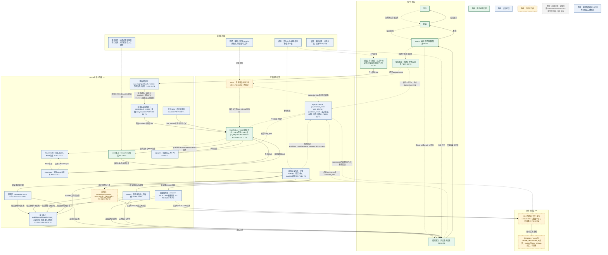

# A部分架构图对应参考

> 用途：供B绘制作业三最终落地架构图时直接检查、微调和渲染，确保A负责的P1–P3、D1–D2、T1–T2与B负责的T3/T4使用同一套目录、标识、发布和生命周期边界。本文是绘图交接材料，不替代`作业三.md`；如文字有冲突，以后者当前版本为准。

## 1. A侧需要在总图中表达的主线

```text
MovieLens三个原始.dat文件
        ↓
raw/.staging按dataset_version暂存，校验齐全、大小、编码和校验和
        ↓ 同一HDFS内rename；正式目录存在则拒绝覆盖
raw/{dataset_version}/形成不可变原始快照和manifest（T1）
        +
rules/{rule_version}/manifest.json提供独立、不可变的规则与评分公式（T1）
        ↓
MapReduce按task固定的版本和时间边界读取，输出到work/{task_id}/{attempt_id}
        ↓
校验五维指标、关键计数、版本、规则、时间边界和必要产物
        ↓
被采用attempt形成稳定quarantine/clean/metrics/reports对象
        ↓
publish/{result_id}/manifest.json只引用稳定路径并保存校验信息与审计快照
        ↓
MySQL事务登记published_result、accepted_attempt_id和SUCCESS（唯一发布边界）
        ↓
Hive在发布后异步登记clean/metrics外部表分区（T2）；失败不回滚SUCCESS
```

核心含义：HDFS保存批量实际对象，MySQL决定正式可见性，Hive只提供可重建的分析访问；`rules`独立于五区，`publish`不复制大产物。

## 2. 建议加入总图的逻辑节点

| 逻辑节点 | 图中职责 | 对应编号 | 成熟度 |
| --- | --- | --- | --- |
| 原始上传与校验 | 接收三个原始`.dat`，检查文件齐全、大小、ISO-8859-1编码和校验和；最后写manifest | P1、P3、D1、T1 | 实验必须实现 |
| 原始区：staging与raw | staging保存未完成上传；校验通过后同HDFS rename为不可变`raw/{dataset_version}`，存在即拒绝覆盖 | P1、P3、D1、D2、T1 | 设计建议 |
| 独立rules目录 | 按`rule_version`只追加保存规则参数、评分公式、实现版本和校验和；不归入五个数据区 | P2、P3、D2、T1 | 设计建议 |
| NameNode | 保存命名空间、文件到Block的映射和Block位置；不承载完整文件数据传输 | P1、P3、D1、T1 | 设计建议 |
| DataNode | 保存实际Block，直接服务MapReduce读写并执行副本相关指令 | P1、P3、D1、T1 | 设计建议 |
| MapReduce治理作业 | 执行清洗前检查与评分、清洗、清洗后检查与评分；跨记录汇总才进入Shuffle/Reduce | P1–P5、D1–D3、T1、T3 | 实验必须实现 |
| work候选区 | 按`task_id/attempt_id`隔离quarantine、clean、metrics、reports候选；失败或未采用attempt不正式可见 | P2、P5、D2、D4、T1、T4 | 实验必须实现 |
| 隔离区quarantine | 保存被采用attempt的JSON Lines异常证据和样例 | P1–P3、D1、D2、T1 | 设计建议 |
| 清洗区clean | 保存被采用的ratings、movies、users；目标Parquet，未验证时回退明确模式文本 | P1–P3、D1、D2、T1、T2 | Parquet待验证 |
| 质量指标区metrics | `pre/post`均用JSON Lines，每行一条五维指标 | P1–P3、D1、D2、T1、T2 | 设计建议 |
| 稳定reports目录 | 保存被采用的不可变报告和大型样例；不另算数据区 | P5、P6、D4、T4 | 设计建议 |
| 发布区publish | 每个result只保存manifest，引用稳定对象并记录版本、时间边界快照和校验信息 | P2、P3、P5、P6、D2、D4、T1、T4 | 设计建议 |
| MySQL InnoDB | `governance_task`保存任务输入权威；`published_result/SUCCESS`构成唯一发布边界 | P4–P6、D3、D4、T4 | 设计建议 |
| Hive外部表与Metastore | 仅登记已发布clean三表和metrics分区，执行批量SQL；元数据可重建 | P2、P3、D2、T2 | 待验证目标 |
| YARN与HDFS日志 | YARN调度MapReduce；聚合日志存HDFS，MySQL只存摘要和路径 | P4、P5、D3、T3、T4 | 待验证目标 |
| 任务接口与结果接口 | 前者创建和查询任务；后者只按MySQL的SUCCESS和manifest读取正式结果 | P4–P6、D3、D4、T3、T4 | 实验必须实现 + 设计建议 |

## 3. 建议标注的数据流

数据流统一用实线箭头，并在箭头上标明对象或格式。

| 起点 → 终点 | 箭头标注 | 对应编号 |
| --- | --- | --- |
| 原始上传与校验 → raw staging | 三个原始`.dat`及上传校验信息 | P1、P3、D1、T1 |
| 正式raw + rules → MapReduce | 有效raw manifest、原始`.dat`、规则manifest | P1–P3、D1、D2、T1、T3 |
| MapReduce → work | 按attempt隔离的quarantine/clean/metrics/reports候选 | P1–P5、D1–D4、T1、T3、T4 |
| work → 稳定目录 | 校验并采用的异常、清洗、指标和报告对象 | P2、P3、P5、D2、D4、T1、T4 |
| 稳定目录 → publish manifest | 稳定路径、版本、校验和、关键计数及时间边界审计快照 | P2、P3、P5、P6、D2、D4、T1、T4 |
| clean/metrics → Hive外部表 | 已发布分区所指向的Parquet或JSON Lines | P2、P3、D2、T2 |
| MapReduce → HDFS logs | 容器日志、阶段日志和执行证据 | P4、P5、D3、T3、T4 |
| manifest及其稳定对象 → 结果接口 → Agent | 正式结构化指标、报告、样例和来源证据 | P6、D4、T4 |

## 4. 建议标注的控制/元数据流

控制或元数据流统一用虚线箭头，并在箭头上写明动作。

| 起点 → 终点 | 箭头标注 | 对应编号 |
| --- | --- | --- |
| 前端/Agent → 任务接口 | 提交请求；创建任务；查询状态 | P4、P6、D3、T3 |
| 任务接口 → MySQL | 校验`t1<t2`并固化dataset、rule、t1、t2；创建后不可变 | P4、P5、D3、D4、T4 |
| 任务接口 → YARN | 提交MapReduce application/job | P4、D3、T3 |
| YARN → MapReduce | 调度、资源分配和失败task attempt重执行 | P4、P5、D3、T3 |
| MapReduce任务 → NameNode | 查询目录与Block位置；申请输出目标 | P1、P3、D1、T1 |
| NameNode ↔ DataNode | Block创建/删除/复制指令；心跳与BlockReport | P1、P3、D1、T1 |
| raw staging → raw | 校验通过后执行同HDFS rename；目标存在则拒绝 | P1、P3、D1、D2、T1 |
| 校验与发布器 → MySQL | 事务登记published_result、accepted_attempt_id、SUCCESS | P5、P6、D4、T4 |
| MySQL → Hive/Metastore | SUCCESS后异步登记clean/metrics分区；失败可重试、不回滚 | P2、P3、P6、D2、D4、T2、T4 |
| 结果接口 → MySQL | 按task/result点查SUCCESS与manifest_path | P6、D4、T4 |
| 运维/清理 → MySQL + manifest | 检查引用后确认非正式对象，人工删除并记录 | P3、P5、D1、D4、T1、T4 |

## 5. 目录、格式与表模型

### 5.1 HDFS目录和格式

```text
/movielens/
  raw/.staging/{dataset_version}/     # 三个.dat；校验失败后按流程人工删除
  raw/{dataset_version}/              # 三个.dat + manifest.json；权威原始快照
  rules/{rule_version}/manifest.json  # 独立不可变规则、评分公式和校验和
  quarantine/{task_id}/               # 稳定异常证据；JSON Lines
  clean/{dataset_version}/{task_id}/  # 稳定ratings/movies/users；目标Parquet，回退文本
  metrics/{task_id}/pre|post/         # 稳定五维指标；JSON Lines
  reports/{task_id}/                  # 稳定报告和大型样例
  work/{task_id}/{attempt_id}/        # 各attempt候选quarantine/clean/metrics/reports
  publish/{result_id}/manifest.json   # 只存引用、版本、时间边界快照和校验信息
  logs/yarn/{application_id}/         # YARN聚合日志
```

`metrics`每行是一条`(task_id, stage, dimension)`记录，至少包含：`task_id, attempt_id, dataset_version, rule_version, stage, dimension, score, numerator, denominator, invalid_count`。`publish`不得复制clean、metrics、quarantine或reports大对象。

### 5.2 Hive外部表

| 表对象 | LOCATION范围 | 分区 | 分桶 | 权威性 |
| --- | --- | --- | --- | --- |
| clean ratings/movies/users | 仅指向已发布稳定clean目录 | `dataset_version, task_id` | 当前不分桶 | 派生分析访问；HDFS文件权威 |
| metrics | 仅指向已发布稳定metrics目录，以兼容JSON SerDe逐行解析 | `task_id, stage` | 当前不分桶 | 派生分析访问；HDFS文件权威 |

Hive外部表保持`external.table.purge=false`，并以HDFS权限保证`DROP TABLE`不能删除权威文件。Metastore可重建；分区登记滞后不影响Agent结果可见性。

### 5.3 MySQL摘要表模型

```text
governance_task(
  task_id PK, dataset_version, rule_version,
  train_cutoff_t1, validation_cutoff_t2,
  status, current_stage, accepted_attempt_id,
  state_version, failed_stage, failure_type,
  failure_code, failure_message, retryable,
  created_at, started_at, finished_at
)

task_attempt(
  attempt_id PK, task_id FK,
  attempt_type, parent_attempt_id,
  yarn_application_id, status, retry_no,
  input_path, candidate_path, log_path,
  started_at, finished_at
)

published_result(
  result_id PK, task_id UNIQUE,
  accepted_attempt_id UNIQUE, publish_token UNIQUE,
  manifest_path, report_path, published_at
)
```

标识关系固定为：`task_id → (dataset_version, rule_version, train_cutoff_t1, validation_cutoff_t2)`，`attempt_id → task_id`。四项任务输入以`governance_task`为权威，重试必须沿用；manifest保存四标识和两个时间边界的审计快照。

## 6. 总图中必须保持的边界

1. **rules独立**：`rules/{rule_version}`不是原始区或发布区的一部分；版本只追加、不覆盖，任务启动后引用不变。
2. **staging与raw分开**：任务只读存在有效manifest的正式raw；校验完成后同HDFS rename，半上传和失败staging不可被读取。
3. **候选与稳定对象分开**：所有attempt先写work；只有被采用attempt可进入稳定quarantine/clean/metrics/reports，失败或迟到attempt无发布权。
4. **publish只存manifest**：manifest只引用稳定路径并保存版本、校验和、关键计数和时间边界快照，不复制大产物。
5. **唯一发布边界在MySQL**：仅`published_result`有效且任务为`SUCCESS`时，结果才对Agent可见；HDFS对象存在、YARN成功或manifest写成均不等于发布成功。
6. **Hive发布后异步登记**：只登记已发布clean/metrics；失败可重试并允许短暂查询滞后，不回滚`SUCCESS`，Agent始终走MySQL＋manifest。
7. **权威与派生分开**：HDFS保存raw、rules及被采用的批量实际对象；MySQL保存任务输入和发布状态权威；Hive Metastore、YARN状态、日志、缓存和查询响应均无发布权。
8. **时间边界不写入clean行**：`train_cutoff_t1`和`validation_cutoff_t2`由`governance_task`保存并快照进manifest；创建任务时必须满足`t1<t2`。
9. **生命周期固定**：raw、rules、被正式manifest引用的quarantine/clean/metrics/reports和publish manifest保留到课程项目结束，不设自动TTL或版本上限。
10. **人工删除固定流程**：仅在任务终态且排障完成后处理work，失败staging须确认未形成正式版本；删除顺序为“检查MySQL→检查manifest→确认非正式对象→人工删除并记录”。
11. **接口边界固定**：Agent只能调用任务接口和结果接口，不得直读work、扫描目录或根据Hive登记状态判断业务成功。

## 7. 与B侧T3/T4的衔接

| A侧设计 | B侧T3/T4衔接方式 |
| --- | --- |
| T1 raw/rules作为固定输入 | T3创建业务attempt后提交MapReduce，读取`governance_task`固化的dataset、rule、t1、t2；计算重试只换`attempt_id`。 |
| T1 work候选目录 | T3每个业务attempt写独立候选路径；MapReduce框架task attempt不能替代业务`attempt_id`。 |
| T1稳定quarantine/clean/metrics和B侧reports | T4在必要产物、五维指标、关键计数、版本及时间边界一致后采用一个attempt；迟到attempt不能覆盖。 |
| T1 publish manifest | T4发布前校验manifest及其稳定对象；MySQL发布失败时对象仍不可见，可只重试发布，不重新计算。 |
| T2 Hive外部表 | T4完成MySQL事务发布后才异步登记分区；Hive失败只造成分析查询滞后。 |
| HDFS权威对象 | T4结果接口先查MySQL `SUCCESS/manifest_path`，再读取manifest引用对象；不得扫描HDFS猜测结果。 |
| A侧生命周期和删除规则 | T4的未登记稳定对象、失败work和staging均走统一引用检查与人工删除，不做自动清理。 |

## 8. 可直接渲染的Mermaid总图草稿



图中实线只表达文件、指标、报告和结果等数据对象流动；虚线只表达提交、查询、调度、状态、元数据、校验和发布动作。`CLEAN`标为待验证是因为目标Parquet链路尚未验证，文本回退不受影响。

## 9. 图例

- **绿色实线框（实验必须实现）**：真实Hadoop/MapReduce读取、清洗和评分，版本/任务标识、候选隔离，以及用户到结果的基本链路。
- **蓝色实线框（设计建议）**：HDFS五区、独立rules、稳定reports、manifest、JSON/JSON Lines、MySQL发布清单、权限与校验等已确认设计。
- **黄色虚线框（待验证目标）**：YARN运行链、Parquet、Hive外部表、JSON SerDe及异步分区登记。
- **灰色虚线框（远期设想）**：对象存储、HBase、Elasticsearch、纠删码或冷热分层；当前均未选入主链路。
- **实线箭头**：数据流，必须标注数据对象或格式。
- **虚线箭头**：控制或元数据流，必须标注提交、调度、查询、状态、校验、rename、登记或清理动作。
- 关键节点保留P、D、T编号；T1/T2是技术选型编号，`t1/t2`是任务时间边界，二者不可混淆。

## 10. 绘图时的最小检查清单

- [ ] 用户、前端、Agent、任务接口、结果接口均已出现，且Agent不直读work或Hive判断正式结果。
- [ ] MapReduce、YARN、NameNode、DataNode均已出现，并区分NameNode元数据访问与DataNode块数据传输。
- [ ] 原始区、隔离区、清洗区、质量指标区、发布区五区齐全；rules、reports、work、logs另列且职责准确。
- [ ] raw已画出staging、校验、最后写manifest、同HDFS rename和正式目录拒绝覆盖。
- [ ] rules独立且不可变；metrics明确为JSON Lines；clean明确Parquet目标和文本回退。
- [ ] work按`task_id/attempt_id`隔离，只有被采用attempt进入稳定quarantine/clean/metrics/reports。
- [ ] publish只保存manifest，并包含四标识、两个时间边界快照、稳定路径和校验信息。
- [ ] MySQL `published_result/SUCCESS`明确为唯一发布边界；HDFS对象存在、YARN成功和Hive登记均不等于业务发布成功。
- [ ] Hive只覆盖已发布clean三表与metrics，分区键正确、当前不分桶、Metastore可重建。
- [ ] Hive登记位于MySQL发布之后，失败可重试且不回滚SUCCESS。
- [ ] `governance_task`保存不可变dataset、rule、t1、t2，且图中未将T1/T2选型编号与t1/t2时间字段混淆。
- [ ] 数据流为实线、控制/元数据流为虚线，每条关键箭头有对象或动作标签。
- [ ] 已标出权威/派生关系，以及校验、权限、监控、日志和生命周期/人工删除流程。
- [ ] P1–P6、D1–D4、T1–T4均至少在关键节点或箭头附近出现。
- [ ] 成熟度图例覆盖实验必须实现、设计建议、待验证目标和远期设想，未把待验证能力画成已实现。
