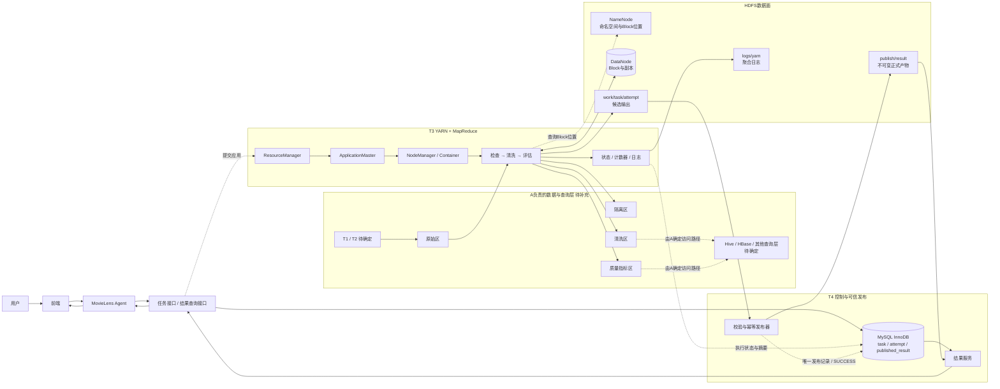

# 作业三：大数据存储和处理与 MovieLens 落地架构

> 本文承接作业二已经确认的问题与设计决策，形成“P/D来源 → 数据对象与访问需求 → 课堂技术 → 工业演进 → 技术选型 → 落地架构”的推理链。本文先完成B负责的P4—P6、D3—D4、T3—T4及架构整合；A负责的T1、T2和相关数据层选型保留待合并位置。

## 3.1 输入与追踪关系

| 来源 | 所需能力与约束 | 候选技术 | 比较维度 | 最终选择 | 选择理由 | 未满足项与补救措施 |
| --- | --- | --- | --- | --- | --- | --- |
| P1—P3、D1—D2 | 待A补充 | HDFS、HBase、Hive、MySQL、对象存储等 | 待A补充 | T1、T2待A确定 | 待A补充 | 待A补充 |
| P4、P5、D3 → T3 | 可切分、可观测、可恢复的异步批处理；支持Shuffle、失败尝试识别和受控重试 | 本地脚本；MapReduce on YARN；Kubernetes Job；托管弹性服务 | 切分与Shuffle、数据本地性、失败恢复、状态与日志、课程匹配、运维和弹性 | 目标架构采用Hadoop MapReduce on YARN；当前仅验证过Hadoop本地模式，YARN链路待实验验证 | MapReduce提供切分、Shuffle、任务尝试、计数器和输出提交；YARN提供资源调度和运行状态，符合批量治理及课程要求 | YARN尚未实测；启动和多阶段落盘开销较高；倾斜与慢任务不会自动消失。后续验证YARN提交、状态和日志，采用异步接口并观测阶段耗时、分区数据量和Shuffle指标；出现独立实时需求或明显潮汐负载后再重评其他方案 |
| P5、P6、D4 → T4 | 候选与正式结果隔离；任务/尝试可查询；迟到尝试不可覆盖；发布幂等；Agent只读正式结果 | 仅HDFS目录；HBase；MySQL InnoDB＋HDFS；仅YARN历史状态 | 事务与唯一约束、点查更新、并发尝试、数据体量、日志吞吐、运维成本 | MySQL InnoDB保存任务、尝试和发布清单；HDFS保存候选输出、正式大结果和聚合日志 | MySQL适合事务、唯一约束和小范围更新；HDFS适合大体量、顺序读写和较少修改的对象；二者按访问模式和一致性要求分工 | HDFS与MySQL没有跨系统事务，可能产生不可见孤儿目录。当前采用“先完成不可变HDFS结果，再登记MySQL发布记录”，课程阶段支持人工或定期清理；一致性或可用性要求提高后再升级自动清理、数据库高可用或更强协调 |

---

## 3.2 数据对象与访问需求

### A负责的数据对象

原始数据、异常数据、清洗数据、质量指标、规则和版本等对象的主存储、格式、分区、生命周期及T1/T2由A补充。B只约定这些对象能够按`dataset_version`、`task_id`和`attempt_id`与计算、发布链路关联。

### Hadoop任务状态、日志和失败信息

| 项目 | 设计内容 |
| --- | --- |
| 数据角色 | MySQL中的业务任务状态是控制面权威元数据；YARN application/job/task状态是计算阶段的执行事实；失败摘要面向用户，完整错误堆栈和容器日志面向运维。 |
| 主存储与访问 | MySQL保存task、attempt、当前阶段、失败摘要和YARN标识；YARN聚合日志保存到HDFS，MySQL只保存摘要和日志位置。 |
| 写入模式 | 总状态按`CREATED → QUEUED → RUNNING → VALIDATING → PUBLISHING → SUCCESS/FAILED`推进；`RUNNING`内部以`CHECK/CLEAN/EVALUATE`表示当前阶段；执行和发布尝试分别追加记录。 |
| 读取模式 | 前端和Agent按task_id读取总状态、当前阶段、失败类型、简短原因和是否可手动重试；运维再按application_id或attempt_id查看详细日志。 |
| 一致性 | 状态转换采用条件更新或版本号，旧尝试不得覆盖已确认状态；YARN阶段成功不等于整个业务任务SUCCESS；日志允许延迟到达，但不能改变业务终态。 |
| 生命周期 | 任务状态和发布关系至少与正式报告同生命周期；详细日志按配置清理，删除前保留失败摘要和证据失效标记。 |
| 对应来源 | P4、P5、D3、T3、T4。 |

当前只实现用户触发的手动重试。计算失败时创建新的计算attempt；结果已经校验但发布失败时，只创建新的发布attempt并复用已有产物，不重新执行检查、清洗和评估。自动重试的次数、间隔和错误分类留待链路稳定后升级。

### 面向用户的报告、样例和查询结果

| 项目 | 设计内容 |
| --- | --- |
| 数据角色 | 正式报告和质量摘要是正式派生结果；异常样例是解释证据；查询响应或缓存不是新的权威副本。 |
| 主存储与访问 | HDFS保存不可变报告、清洗产物和大型样例集合；MySQL保存published_result、摘要指标、路径和任务/尝试关系。结果服务先查发布清单，再读取对应HDFS对象。 |
| 写入模式 | MapReduce写attempt专属候选目录；校验后形成不可变发布对象；MySQL事务插入唯一发布记录并把任务切换为SUCCESS。 |
| 读取模式 | 按task_id/result_id查询报告和摘要，按dataset_version查询历史任务；禁止结果服务扫描候选目录猜测“最新结果”。 |
| 一致性 | 只有存在有效published_result且任务为SUCCESS的结果可见。发布失败时任务为FAILED、失败阶段为PUBLISHING，已校验产物保持不可见但可供手动重试发布。 |
| 生命周期 | 正式结果采用A确定的版本策略；未被发布记录引用的候选和孤儿对象确认后清理；缓存可失效重建。 |
| 对应来源 | P5、P6、D4、T4，并与A的D2、T1、T2衔接。 |

`SUCCESS`表示正式结果已经发布并可由Agent/前端查询，不以某一次网络响应是否成功送达为判断条件。

### B侧摘要表模型

```text
governance_task(
  task_id PK, dataset_version, rule_version,
  status, current_stage, accepted_attempt_id,
  state_version, failed_stage, failure_type,
  failure_code, failure_message, retryable,
  created_at, started_at, finished_at
)

task_attempt(
  attempt_id PK, task_id FK,
  attempt_type, parent_attempt_id,
  yarn_application_id, status, retry_no,
  input_path, candidate_path, log_path,
  started_at, finished_at
)

published_result(
  result_id PK, task_id UNIQUE,
  accepted_attempt_id UNIQUE, publish_token UNIQUE,
  manifest_path, report_path, published_at
)
```

---

## 3.3 课堂技术与候选方案

### 存储与访问模式、HBase、Hive及其他访问层

行存、列存、倒排索引、HBase、Hive、文件格式及查询职责由A结合P1—P3、D1—D2和T1—T2补充。B不预设Parquet/ORC/Text、RowKey、列族、Hive表或Elasticsearch职责。

### HDFS角色与读写

- **NameNode**维护命名空间、文件到Block的映射和Block位置等元数据，不传输全部文件内容。
- **DataNode**保存实际Block，响应客户端读写，发送心跳和BlockReport，并执行Block创建、删除或复制。
- **Block与副本**用于分布式存储和节点故障容忍，大小及副本数应按环境配置。
- **Secondary NameNode**合并fsimage与edits形成检查点，不是NameNode热备。

```text
读取：客户端 → NameNode查询Block位置 → 客户端直接从就近DataNode读取
写入：客户端 → NameNode请求目标 → 客户端沿DataNode管线写入并形成副本 → 完成文件
```

### B侧HDFS目录边界

```text
/movielens/
  raw/{dataset_version}/             # A确定格式与权威性
  quarantine/{task_id}/              # A负责异常数据设计
  clean/{dataset_version}/{task_id}/ # A负责清洗数据设计
  metrics/{task_id}/pre|post/        # A负责指标格式
  work/{task_id}/{attempt_id}/       # B：隔离的候选输出
  publish/{result_id}/               # B：不可变正式产物
  logs/yarn/{application_id}/        # B：聚合日志
```

`work/task/attempt`隔离多个执行尝试；`publish/result`只保存完整不可变产物，结果服务通过MySQL发布清单访问。任务状态不写成HDFS小文件。

### MapReduce处理链路

```text
Job A：清洗前质量检查与评分
  Map逐记录检查 → 可选Combine局部计数 → Partition/Shuffle/Sort → Reduce形成指标

Job B：数据清洗
  Map逐记录标准化和合法性处理
  仅在全局去重或跨记录规则确有需要时进入Shuffle/Reduce

Job C：清洗后质量检查与评分
  复用Job A的指标定义，形成可比较结果

发布：校验必要产物和关键计数 → 生成manifest → 登记正式发布
```

| 环节 | 用途 | 使用边界 |
| --- | --- | --- |
| Map | 解析、字段检查、逐行清洗和局部统计 | 不直接写正式结果或业务终态 |
| Sort/Shuffle | 汇集相同指标键、去重键或聚合键 | 仅在跨记录汇总时使用，并记录Shuffle指标 |
| Combine | 减少可聚合计数的网络传输 | 是可选优化，不能依赖其执行保证业务正确性；仅用于满足结合律和交换律的操作 |
| Partition | 决定中间键进入哪个Reduce | 相同键必须稳定进入同一分区，并监控热点分区 |
| Reduce | 全局计数、去重或按键聚合 | 数量过少可能形成长尾，过多会增加任务和小文件；参数待实测 |

Hadoop默认文件输出提交实现先写任务尝试工作区，再由OutputCommitter提交单个作业输出。它不保证Job A、B、C及多目录报告整体原子，因此T4仍需用发布清单控制可见性。框架task attempt与业务attempt_id属于不同层级；计数器也不能识别用户重复提交的两个独立业务任务。

### 是否纳入本系统

**纳入HDFS与MapReduce**：实验要求Agent调用Hadoop，工作负载属于批量扫描、清洗和聚合。当前不假定多DataNode、NameNode HA或机架拓扑，也不预设Block大小、Reduce数量、超时和重试次数。

---

## 3.4 工业界演进：YARN到容器化、托管与弹性计算

### 七项要求追踪

| 要求 | 本方向结论 |
| --- | --- |
| 对应P和D | P4/D3：资源争用、长尾、观测和异步执行；P5/D3/D4：失败尝试、日志和发布；P6/D4：迁移后仍保持状态、结果和证据一致。 |
| 数据与读写路径 | 处理原始数据、候选清洗结果、质量指标和报告等批量对象；YARN直接读写HDFS，未来容器化/托管计算通过稳定持久存储交换输入输出。 |
| 与现有组件交换 | Agent经任务接口提交；后端按task_id/attempt_id读输入、写候选结果与manifest；发布器登记MySQL清单；结果服务读取正式结果。 |
| 权威数据 | A选定的主存储保存权威原始/清洗数据，MySQL保存权威业务状态和发布清单；调度平台状态、日志、缓存和迁移验证副本均不拥有正式发布权。 |
| 引入条件 | 依赖隔离、任务峰谷、排队延迟、静态资源成本或控制面可用性成为主要问题时才迁移；当前没有实测阈值。 |
| 候选比较 | 比较长期HDFS＋YARN、Kubernetes/容器化任务和托管弹性服务；当前选YARN，后两者作为有条件演进路线。 |
| 新增风险 | 平台运维或云费用、远程读写和网络成本、数据本地性减弱、提交语义变化、厂商依赖、状态映射和迁移期一致性。 |

### 路线比较

| 路线 | 优点 | 风险与限制 | 本系统判断 |
| --- | --- | --- | --- |
| 长期HDFS＋YARN | 与课程和MapReduce最匹配；可利用HDFS本地性；机制清晰 | 节点容量较固定；可能产生空闲成本；需自行维护集群 | 当前目标架构 |
| Kubernetes或YARN容器运行时 | 镜像隔离、环境可复现，可与既有容器平台统一 | Kubernetes Job不自动提供MapReduce Shuffle和HDFS本地性；存储、网络、日志与安全集成复杂 | 当前不引入；组织已有成熟平台且依赖冲突突出时重评 |
| 托管/弹性/Serverless服务 | 降低控制面运维，适合潮汐和临时任务 | 云费用、启动延迟、厂商依赖、网络传输及可观测模型变化 | 生产化且静态成本或排队问题突出时评估 |

迁移前后保持task_id、attempt_id、输入版本、候选输出和manifest契约。计算平台只生成候选结果，MySQL发布器仍掌握唯一正式发布权。是否迁移应依据队列等待、启动时间、节点利用率、单位任务成本、恢复时间和控制面可用性，而不是预设固定数据条数。

论文、Apache Hadoop/Kubernetes开源实现以及Amazon EMR Serverless、Google Dataproc等实际托管服务证明相关机制和路线真实存在，但不代表本项目已经部署，也不能直接照搬其费用、延迟或SLA。

---

## 3.5 技术选型记录

### T1、T2

由A根据P1—P3、D1—D2补充候选、比较维度、最终选择、配置、替换条件和风险。

### T3：Hadoop MapReduce on YARN承担治理批处理

| 项目 | 内容 |
| --- | --- |
| 来源 | P4、P5、D3。 |
| 最终选择 | 目标架构采用MapReduce on YARN；当前实验仅验证Hadoop本地模式，YARN运行链待后续验证。 |
| 落地方式 | 任务接口创建逻辑任务并提交MapReduce；保存application/job标识；作业读取A定义的输入区并写attempt候选目录；进度、计数器和日志映射到业务状态；全部阶段完成后进入T4发布。 |
| 选择理由 | 直接支持批量切分、Shuffle、失败任务重执行、任务尝试、日志和计数器，并符合课程技术边界。 |
| 限制与替换条件 | 启动和落盘开销高、静态资源可能空闲、倾斜不会自动消失；低延迟、持续增量或潮汐成本成为硬约束后再比较流处理、容器化或托管服务。 |

### T4：MySQL事务发布清单＋HDFS不可变结果和日志

| 项目 | 内容 |
| --- | --- |
| 来源 | P5、P6、D4。 |
| 最终选择 | MySQL InnoDB保存task、attempt、published_result和少量证据；HDFS保存候选输出、正式大结果和YARN聚合日志。 |
| 落地方式 | MapReduce完成attempt专属输出；发布器校验产物后形成不可变发布对象；MySQL事务使用唯一publish_token登记published_result、设置accepted_attempt_id并将任务切换为SUCCESS；结果服务只读取被清单引用的路径。 |
| 选择理由 | InnoDB适合点查、状态更新、事务和唯一约束；HDFS适合大体量顺序读写。二者按访问模式和一致性要求分工。 |
| 限制与替换条件 | 无跨系统原子事务，可能留下不可见孤儿目录；课程阶段保留人工或定期清理。状态规模、可用性或一致性要求显著提高后，再评估数据库高可用、自动清理或更强协调。 |

---

## 3.6 落地架构图

> 图中A区域为合并占位，待T1、T2确认后替换；B区域展示已经审核的T3、T4、任务状态和发布链路。



### 权威性与非功能边界

- A选定的主存储保存权威原始、异常、清洗和指标数据；MySQL task/attempt保存权威业务状态，published_result保存正式结果目录。
- HDFS `work`是内部候选区；只有被published_result引用的不可变`publish/result`才对结果服务可见。
- YARN状态、计数器和日志是执行证据，不替代业务SUCCESS状态；查询响应和缓存只是派生数据。
- Agent只能调用任务和结果接口，不能直接遍历候选目录。
- 监控至少覆盖阶段耗时、分区处理量、Shuffle数据量、失败次数和队列等待；日志由HDFS承载，MySQL保存摘要和位置。
- Secondary NameNode不承担高可用；NameNode HA、MySQL高可用和更强跨系统协调按实际可用性要求后续评估。

---

## 分阶段落地与回退

| 阶段 | 采用能力 | 暂不采用 | 回退方式 |
| --- | --- | --- | --- |
| 当前实验 | Hadoop本地模式；基础task/attempt；候选目录；手动重试和简化发布 | 自动重试、YARN已部署假设、Kubernetes、托管弹性、跨系统强事务 | 保留原始输入；计算失败后人工重跑；发布失败仅重试发布；失败候选不登记为正式结果 |
| 链路完善 | 验证MapReduce on YARN；MySQL事务发布清单；YARN日志聚合；孤儿清理；分区指标 | 流处理和复杂跨系统事务 | 关闭自动增强能力，保留相同任务、输入输出和manifest契约 |
| 规模增长 | 按证据增加高可用、队列隔离和阶段恢复；评估容器化或托管弹性 | 未经压测的组件堆叠 | 计算后端保持稳定契约，可切回YARN而不改变Agent与结果服务接口 |

## 参考资料

1. Apache Hadoop, [HDFS Architecture](https://hadoop.apache.org/docs/current/hadoop-project-dist/hadoop-hdfs/HdfsDesign.html).
2. Apache Hadoop, [HDFS Users Guide](https://hadoop.apache.org/docs/current/hadoop-project-dist/hadoop-hdfs/HdfsUserGuide.html).
3. Apache Hadoop, [MapReduce Tutorial](https://hadoop.apache.org/docs/current/hadoop-mapreduce-client/hadoop-mapreduce-client-core/MapReduceTutorial.html)及[OutputCommitter API](https://hadoop.apache.org/docs/current/api/org/apache/hadoop/mapreduce/OutputCommitter.html).
4. Dean and Ghemawat, [*MapReduce: Simplified Data Processing on Large Clusters*](https://research.google/pubs/mapreduce-simplified-data-processing-on-large-clusters/), OSDI 2004.
5. Apache Hadoop, [YARN Architecture](https://hadoop.apache.org/docs/current/hadoop-yarn/hadoop-yarn-site/YARN)、[YARN Docker Runtime](https://hadoop.apache.org/docs/current/hadoop-yarn/hadoop-yarn-site/DockerContainers.html)及[Apache Hadoop开源仓库](https://github.com/apache/hadoop).
6. Vavilapalli et al., [*Apache Hadoop YARN: Yet Another Resource Negotiator*](https://www.cs.cmu.edu/~garth/15719/papers/yarn.pdf), SoCC 2013.
7. MySQL, [InnoDB Introduction](https://dev.mysql.com/doc/refman/8.4/en/innodb-introduction.html)及[PRIMARY KEY/UNIQUE约束](https://dev.mysql.com/doc/refman/8.4/en/constraint-primary-key.html).
8. Kubernetes, [Jobs](https://kubernetes.io/docs/concepts/workloads/controllers/job/)及[Kubernetes开源仓库](https://github.com/kubernetes/kubernetes).
9. Amazon, [EMR Serverless User Guide](https://docs.aws.amazon.com/emr/latest/EMR-Serverless-UserGuide/emr-serverless-user-guide.pdf).
10. Google Cloud, [Dataproc Autoscaling](https://cloud.google.com/dataproc/docs/concepts/configuring-clusters/autoscaling).

