# 作业三：大数据存储和处理与 MovieLens 落地架构

> 本文承接作业二已经确认的问题与设计决策，形成“P/D来源 → 数据对象与访问需求 → 课堂技术 → 工业演进 → 技术选型 → 落地架构”的推理链。当前版本已形成T1—T4可交接初稿；未完成实验验证的能力均按目标设计、回退方案或远期设想标注。

## 3.1 输入与追踪关系

为避免导出 PDF 时横向表格换页错乱，以下改为按技术选型逐项纵向展开。

### T1：批量主存储与版本化目录

| 项目 | 内容 |
| --- | --- |
| 来源 | P1、P3、D1，并关联P2、D2。 |
| 所需能力与约束 | 批量大文件需顺序读写、按版本定位并在节点故障后判断可用性；数据分级保护，正式版本不可覆盖。 |
| 候选技术 | 本地文件；HDFS；对象存储。格式子候选包括Text、Parquet、ORC。 |
| 比较维度 | 容错、吞吐、数据本地性、版本隔离、恢复与运维成本；格式保真、列裁剪、压缩、模式和兼容性。 |
| 最终选择 | HDFS版本化目录为批量主存储；raw经staging校验后rename，rules及被采用的quarantine/clean/metrics/reports各存稳定对象，publish仅存manifest。 |
| 选择理由 | HDFS适合Hadoop大文件批处理和不可变快照；原文便于追溯，Parquet利于列裁剪和聚合。 |
| 未满足项与补救措施 | 多节点、副本及Parquet链路未验证，实验回退HDFS文本＋MapReduce；业务发布由manifest校验和B侧MySQL补足，存算分离成为需求时重评对象存储。 |

### T2：批量SQL访问层

| 项目 | 内容 |
| --- | --- |
| 来源 | P2、P3、D2，并关联P1、D1。 |
| 所需能力与约束 | 按版本和任务定位正式数据，支持批量SQL扫描、聚合、历史比较；事务更新与分析分离。 |
| 候选技术 | Hive外部表；HBase；MySQL；Elasticsearch。 |
| 比较维度 | 扫描聚合、点查更新、全文检索、事务一致性、HDFS复用、分区裁剪、运维成本。 |
| 最终选择 | Hive外部表提供HDFS批量SQL，按已知查询键分区、当前不分桶；MySQL发布后异步登记分区；不引入HBase和Elasticsearch。 |
| 选择理由 | Hive复用HDFS文件并提供模式和SQL；MySQL是唯一发布边界，Hive只作可重建分析访问层。 |
| 未满足项与补救措施 | Hive登记可重试并允许短暂查询滞后，失败不回滚SUCCESS；链路未验证时MapReduce直读文本，出现在线点查、持续更新或全文搜索时重评HBase和Elasticsearch。 |

### T3：异步治理批处理

| 项目 | 内容 |
| --- | --- |
| 来源 | P4、P5、D3。 |
| 所需能力与约束 | 可切分、可观测、可恢复的异步批处理；支持Shuffle、失败尝试识别和受控重试。 |
| 候选技术 | 本地脚本；MapReduce on YARN；Kubernetes Job；托管弹性服务。 |
| 比较维度 | 切分与Shuffle、数据本地性、失败恢复、状态与日志、课程匹配、运维和弹性。 |
| 最终选择 | 目标架构采用Hadoop MapReduce on YARN；当前仅验证过Hadoop本地模式，YARN链路待实验验证。 |
| 选择理由 | MapReduce提供切分、Shuffle、任务尝试、计数器和输出提交；YARN提供资源调度和运行状态，符合批量治理及课程要求。 |
| 未满足项与补救措施 | YARN尚未实测；启动和多阶段落盘开销较高；倾斜与慢任务不会自动消失。后续验证YARN提交、状态和日志，采用异步接口并观测阶段耗时、分区数据量和Shuffle指标；出现独立实时需求或明显潮汐负载后再重评其他方案。 |

### T4：可信发布与正式可见性

| 项目 | 内容 |
| --- | --- |
| 来源 | P5、P6、D4。 |
| 所需能力与约束 | 候选与正式结果隔离；任务/尝试可查询；迟到尝试不可覆盖；发布幂等；Agent只读正式结果。 |
| 候选技术 | 仅HDFS目录；HBase；MySQL InnoDB＋HDFS；仅YARN历史状态。 |
| 比较维度 | 事务与唯一约束、点查更新、并发尝试、数据体量、日志吞吐、运维成本。 |
| 最终选择 | MySQL InnoDB保存任务、尝试和发布记录；HDFS稳定目录保存被采用数据与报告，`publish/{result_id}/manifest.json`只存清单。 |
| 选择理由 | MySQL负责事务可见性，HDFS适合不可变大对象；manifest以版本、路径和校验信息引用稳定对象，不复制大产物。 |
| 未满足项与补救措施 | HDFS与MySQL无跨系统事务；先形成并校验稳定对象和manifest，再事务登记published_result/accepted_attempt_id/SUCCESS，未登记对象不可见并按人工流程清理；后续再评估高可用或更强协调。 |

---

## 3.2 数据对象与访问需求

### A负责的数据对象

**技术选型T1/T2**分别采用HDFS版本化目录和Hive外部表，不同于训练/验证时间边界字段`train_cutoff_t1、validation_cutoff_t2`；A定义`raw/quarantine/clean/metrics`稳定数据目录及独立rules目录，B负责work候选隔离、reports稳定报告、publish manifest、正式可见性、状态和日志；Parquet/Hive未验证时回退HDFS文本＋MapReduce直读。

以下按数据对象逐项展开，统一采用“项目/内容”的纵向结构，减少导出时表格横向溢出。

#### MovieLens原始文件（`ratings.dat`、`movies.dat`、`users.dat`）

| 项目 | 内容 |
| --- | --- |
| 数据角色 | 权威源数据，是清洗、复算和追溯起点。 |
| 主存储与格式 | HDFS正式目录`/movielens/raw/{dataset_version}/`；暂存目录`/movielens/raw/.staging/{dataset_version}/`。保留原始`.dat`和ISO-8859-1编码，manifest记录三文件、版本及校验信息。 |
| 写入模式 | 上传三文件至staging，检查齐全、大小、编码和校验和，最后写manifest，再在同一HDFS内rename至正式目录；正式目录已存在则拒绝覆盖。 |
| 读取模式 | MapReduce只全量读取存在有效manifest的正式目录，不读取staging。 |
| 一致性要求 | manifest与三文件校验通过且rename完成后才可用；半上传不得被任务读取。 |
| 生命周期 | 正式raw保留到课程项目结束，无自动TTL或版本上限；失败staging确认未形成正式版本后人工删除。 |
| 对应P/D/T | P1、P2、P3；D1、D2；T1。 |

#### 解析失败或规则判定异常的记录

| 项目 | 内容 |
| --- | --- |
| 数据角色 | 隔离证据和可复核派生数据，不是清洗后正式数据。 |
| 主存储与格式 | 候选位于HDFS `/movielens/work/{task_id}/{attempt_id}/quarantine/`；被采用后稳定路径为`/movielens/quarantine/{task_id}/`。建议使用JSON Lines或带明确转义的文本，保存原始行、来源文件、失败原因和`attempt_id`等处理证据。 |
| 写入模式 | 由清洗任务按attempt批量写候选；采用时形成不可变稳定目录，不在正式目录追加。 |
| 读取模式 | 按`task_id`读取正式异常统计和样例，必要时按来源文件或异常原因扫描；执行排障才按`attempt_id`读取候选。 |
| 一致性要求 | 失败attempt不可混入正式证据；只有被采用attempt的记录可被正式报告引用；重复执行不得重复计入正式指标。 |
| 生命周期 | 正式manifest引用者保留到课程项目结束；work候选按统一人工删除流程处理。 |
| 对应P/D/T | P1、P2、P3；D1、D2；T1。 |

#### 清洗后的`ratings`

| 项目 | 内容 |
| --- | --- |
| 数据角色 | 正式派生数据，供后续评分预测及行为分析使用。 |
| 主存储与格式 | HDFS `/movielens/clean/{dataset_version}/{task_id}/ratings/`；目标格式为Parquet，未验证时用带明确模式的文本；字段仅为`UserID、MovieID、Rating、Timestamp`，不重复保存任务时间边界。 |
| 写入模式 | MapReduce先写`work/{task_id}/{attempt_id}/clean/ratings/`；校验并采用后形成不可变稳定目录，不追加、不原地更新。 |
| 读取模式 | MapReduce全量扫描；目标Hive外部表用于按用户/电影聚合及时间范围过滤。 |
| 一致性要求 | 必须与同一`dataset_version`、`rule_version`、`task_id`和被采用attempt的`movies/users`、指标成组可见；不得发布部分文件。 |
| 生命周期 | 正式manifest引用者保留到课程项目结束，无自动TTL或版本上限；候选按统一流程清理。 |
| 对应P/D/T | P1、P2、P3；D1、D2；T1、T2。 |

#### 清洗后的`movies`

| 项目 | 内容 |
| --- | --- |
| 数据角色 | 正式派生数据，提供电影标题和类型维度。 |
| 主存储与格式 | HDFS `/movielens/clean/{dataset_version}/{task_id}/movies/`；目标格式为Parquet，未验证时回退文本；字段仅为`MovieID、Title、Genres`，`Genres`保留原有竖线分隔语义。 |
| 写入模式 | 先写`work`中本attempt的`clean/movies/`，采用后形成不可变稳定目录。 |
| 读取模式 | MapReduce全量扫描、按`MovieID`关联；目标Hive用于SQL关联，类型拆分仅在计算时进行。 |
| 一致性要求 | 与同任务`ratings/users`及指标成组可见；`MovieID`关系校验失败时不得标记为正式可用。 |
| 生命周期 | 正式manifest引用者保留到课程项目结束，无自动TTL或版本上限；不得被新任务覆盖。 |
| 对应P/D/T | P1、P2、P3；D1、D2；T1、T2。 |

#### 清洗后的`users`

| 项目 | 内容 |
| --- | --- |
| 数据角色 | 正式派生数据，提供匿名用户属性维度。 |
| 主存储与格式 | HDFS `/movielens/clean/{dataset_version}/{task_id}/users/`；目标格式为Parquet，未验证时回退文本；字段仅为`UserID、Gender、Age、Occupation、Zip-code`，邮编按字符串保存。 |
| 写入模式 | 先写`work`中本attempt的`clean/users/`，采用后形成不可变稳定目录。 |
| 读取模式 | MapReduce全量扫描、按`UserID`关联；目标Hive用于分组聚合。 |
| 一致性要求 | 与同任务`ratings/movies`及指标成组可见；不得跨任务拼接三类清洗数据。 |
| 生命周期 | 正式manifest引用者保留到课程项目结束，无自动TTL或版本上限；候选按统一流程清理。 |
| 对应P/D/T | P1、P2、P3；D1、D2；T1、T2。 |

#### 清洗前/后五维质量指标

| 项目 | 内容 |
| --- | --- |
| 数据角色 | 正式派生结果和报告证据，覆盖Accurate、Complete、Unique、Up-to-date、Consistent。 |
| 主存储与格式 | HDFS `/movielens/metrics/{task_id}/pre/`与`post/`；JSON Lines每行一条`(task_id, stage, dimension)`指标，字段至少含`task_id, attempt_id, dataset_version, rule_version, stage, dimension, score, numerator, denominator, invalid_count`。 |
| 写入模式 | 各阶段先写`work/{task_id}/{attempt_id}/metrics/pre|post/`；五维齐全且校验通过后形成稳定目录，评分公式由rules版本定义。 |
| 读取模式 | Agent/报告按`task_id`读取；Hive按`task_id、stage`分区并逐行解析JSON Lines，普通列包含其余字段。 |
| 一致性要求 | `pre`与`post`必须来自同一任务并分别绑定原始、清洗版本；缺维度、版本或规则错配均不可见。 |
| 生命周期 | 正式manifest引用者保留到课程项目结束，无自动TTL或版本上限；候选按统一流程清理。 |
| 对应P/D/T | P1、P2、P3；D1、D2；T1、T2。 |

#### 清洗规则版本（`rule_version`）

| 项目 | 内容 |
| --- | --- |
| 数据角色 | 权威处理定义及血缘元数据，不是数据内容副本。 |
| 主存储与格式 | 不可变规则清单保存于`/movielens/rules/{rule_version}/manifest.json`，至少记录规则参数、评分公式、必要的实现版本和校验和；B侧MySQL任务记录仍只保存`rule_version`。 |
| 写入模式 | 新规则生成新版本，只追加不覆盖；任务创建时按`rule_version`固定引用。 |
| 读取模式 | 按`rule_version`定位并校验规则清单，处理任务读取其规则参数、评分公式和实现版本。 |
| 一致性要求 | 已启动任务的规则引用不可变；同名版本内容和校验和不得变化，正式可见前校验任务引用与候选产物记录一致。 |
| 生命周期 | 所有rules版本保留到课程项目结束，无自动TTL或版本上限。 |
| 对应P/D/T | P2、P3；D1、D2；T1。 |

#### 数据版本（`dataset_version`）

| 项目 | 内容 |
| --- | --- |
| 数据角色 | 原始快照的权威版本标识和全部派生产物的血缘入口。 |
| 主存储与格式 | 使用`/movielens/raw/{dataset_version}/manifest.json`描述该版本包含的三个原始文件；B侧MySQL任务记录只保存版本值。 |
| 写入模式 | 每次原始快照登记一个新版本，只追加不覆盖；清洗任务只引用已校验版本。 |
| 读取模式 | 按版本确定manifest及原始文件路径，按版本查询相关任务、清洗结果、指标和报告。 |
| 一致性要求 | 一个版本必须唯一对应确定的三文件集合；文件内容变化必须产生新版本，不能复用旧标识。 |
| 生命周期 | 所有正式raw版本保留到课程项目结束，无自动TTL或版本上限。 |
| 对应P/D/T | P1、P2、P3；D1、D2；T1。 |

四个标识统一按以下关系使用：`dataset_version`标识已校验原始快照，`rule_version`标识不可变规则集合，`task_id`标识绑定这两个版本及时间边界`train_cutoff_t1、validation_cutoff_t2`的一次逻辑任务，`attempt_id`标识一次执行或重试，即`task_id → (dataset_version, rule_version, train_cutoff_t1, validation_cutoff_t2)`、`attempt_id → task_id`。创建任务时必须校验`train_cutoff_t1 < validation_cutoff_t2`；四项输入以MySQL governance_task为权威，创建后不可变，重试沿用，任一变化均新建任务。publish manifest保存四标识及两个时间边界的审计快照，发布前与MySQL校验一致；clean行不重复保存时间边界。技术选型T1/T2与这两个时间边界字段不是同一概念。

课程阶段统一生命周期：raw、rules及被正式manifest引用的quarantine/clean/metrics/reports和publish manifest全部保留到课程项目结束，不设自动TTL或版本上限；work候选仅在任务终态且排障完成后删除，失败staging仅在确认未形成正式版本后删除。删除流程为“检查MySQL → 检查manifest → 确认非正式对象 → 人工删除并记录结果”；Hive元数据可重建，但`DROP TABLE`不得删除HDFS权威文件。

### Hadoop任务状态、日志和失败信息

| 项目 | 设计内容 |
| --- | --- |
| 数据角色 | MySQL中的业务任务状态是控制面权威元数据；YARN application/job/task状态是计算阶段的执行事实；失败摘要面向用户，完整错误堆栈和容器日志面向运维。 |
| 主存储与访问 | MySQL保存task、attempt、当前阶段、失败摘要和YARN标识；YARN聚合日志保存到HDFS，MySQL只保存摘要和日志位置。 |
| 写入模式 | 总状态按`CREATED → QUEUED → RUNNING → VALIDATING → PUBLISHING → SUCCESS/FAILED`推进；<br>`RUNNING`内部以`CHECK/CLEAN/EVALUATE`表示当前阶段；执行和发布尝试分别追加记录。 |
| 读取模式 | 前端和Agent按task_id读取总状态、当前阶段、失败类型、简短原因和是否可手动重试；运维再按application_id或attempt_id查看详细日志。 |
| 一致性 | 状态转换采用条件更新或版本号，旧尝试不得覆盖已确认状态；YARN阶段成功不等于整个业务任务SUCCESS；日志允许延迟到达，但不能改变业务终态。 |
| 生命周期 | 任务状态和发布关系至少与正式报告同生命周期；详细日志按配置清理，删除前保留失败摘要和证据失效标记。 |
| 对应来源 | P4、P5、D3、T3、T4。 |

当前只实现用户触发的手动重试。计算失败时创建新的计算attempt；结果已经校验但发布失败时，只创建新的发布attempt并复用已有产物，不重新执行检查、清洗和评估。自动重试的次数、间隔和错误分类留待链路稳定后升级。

### 面向用户的报告、样例和查询结果

| 项目 | 设计内容 |
| --- | --- |
| 数据角色 | 正式报告和质量摘要是正式派生结果；异常样例是解释证据；查询响应或缓存不是新的权威副本。 |
| 主存储与访问 | HDFS `/movielens/reports/{task_id}/`保存被采用的不可变报告和大型样例；`publish/{result_id}/manifest.json`仅记录结果版本、稳定路径和校验信息，不保存大产物。MySQL保存published_result，其中`manifest_path`决定正式可见性，`report_path`可指向稳定reports目录。 |
| 写入模式 | 报告和大型样例先写`work/{task_id}/{attempt_id}/reports/`，采用后进入稳定reports目录；形成并校验稳定对象与manifest后，MySQL事务插入published_result、设置accepted_attempt_id并切换SUCCESS。 |
| 读取模式 | 按task_id或result_id先读取MySQL `manifest_path`，再按manifest路径读取reports、quarantine、clean或metrics稳定对象；报告可直接使用`report_path`。禁止扫描候选目录或复制大产物到publish。 |
| 一致性 | 仅当published_result有效且任务为SUCCESS时可见。MySQL登记失败时，已形成的稳定对象和manifest仍不可见，可供重试发布或确认无引用后清理。 |
| 生命周期 | 被正式manifest引用的reports保留到课程项目结束，无自动TTL或版本上限；work候选按统一人工删除流程处理，缓存可失效重建。 |
| 对应来源 | P5、P6、D4、T4，并与A的D2、T1、T2衔接。 |

`SUCCESS`表示MySQL已完成正式发布并可由Agent/前端查询，不以网络响应或后续Hive分区是否登记成功为判断条件。

### B侧摘要表模型

```text
governance_task(
  task_id PK, dataset_version, rule_version,
  train_cutoff_t1, validation_cutoff_t2,
  status, current_stage, accepted_attempt_id,
  state_version, failed_stage, failure_type,
  failure_code, failure_message, retryable,
  created_at, started_at, finished_at
)

task_attempt(
  attempt_id PK, task_id FK,
  attempt_type, parent_attempt_id,
  yarn_application_id, status, retry_no,
  input_path, candidate_path, log_path,
  started_at, finished_at
)

published_result(
  result_id PK, task_id UNIQUE,
  accepted_attempt_id UNIQUE, publish_token UNIQUE,
  manifest_path, report_path, published_at
)
```

---

## 3.3 课堂技术与候选方案

### 存储与访问模式、HBase、Hive及其他访问层

#### 存储形态与访问模式

为避免宽表跨页，存储形态改为逐项纵向比较。

##### 行存（如MySQL InnoDB）

| 项目 | 内容 |
| --- | --- |
| 擅长的访问模式 | 按主键点查、小范围更新、事务和唯一约束。 |
| 主要限制 | 扫描少数列时仍需读取完整行，不适合把大文件作为事务记录保存。 |
| 本系统结论 | 仅由B侧保存task、attempt和发布清单等小型控制元数据，不保存MovieLens批量权威数据。 |

##### 列存文件（Parquet/ORC）

| 项目 | 内容 |
| --- | --- |
| 擅长的访问模式 | 只读取所需列、压缩编码、批量过滤和聚合。 |
| 主要限制 | 不适合逐行随机更新；写入器、模式和引擎兼容性需验证。 |
| 本系统结论 | clean目标采用Parquet；ORC保留为Hive重度使用时的候选，不同时维护两份权威格式。 |

##### 倒排索引（Elasticsearch）

| 项目 | 内容 |
| --- | --- |
| 擅长的访问模式 | 标题、错误原因、日志等文本的关键词检索和相关性排序。 |
| 主要限制 | 索引是派生副本，写入与刷新带来一致性和运维成本，不适合事务真相或批量全表聚合。 |
| 本系统结论 | 当前没有全文检索硬需求，不引入；未来出现大规模标题或日志全文搜索时从HDFS或MySQL受控构建可重建索引。 |

##### Text/JSON Lines

| 项目 | 内容 |
| --- | --- |
| 擅长的访问模式 | 原文保真、人工检查、流式逐行解析和跨工具交换。 |
| 主要限制 | 类型与模式约束弱，列裁剪和压缩效率低。 |
| 本系统结论 | raw保留原始`.dat`；quarantine与metrics采用JSON Lines；Parquet链路未验证时clean回退为有明确模式的文本。 |

从存储抽象看，**Block**是HDFS内部的分布与容错单位，不能作为业务版本直接查询；**文件/目录**提供Hadoop可切分的批量输入输出及清晰版本边界，是当前主形态；**对象存储**以对象键和API提供持久化，适合存算分离和弹性计算，但缺少当前HDFS数据本地性，且提交、一致性、网络费用与凭据管理需另行验证。因此本轮不同时维护HDFS和对象存储两份权威数据。

事务负载与分析负载分开处理：任务状态、采用哪个attempt及发布唯一性属于小数据事务，由B侧MySQL负责；原始、异常、清洗数据和指标由HDFS保存、MapReduce处理，其中仅clean三表和metrics目标由Hive提供SQL访问。权威边界仍是HDFS中的批量数据和MySQL中的控制元数据，Hive Metastore、未来HBase或Elasticsearch均不得自行成为另一份业务真相。

#### HBase机制与是否纳入

- **HMaster**负责表和Region管理、负载均衡及故障协调，不承载普通数据读写；**RegionServer**服务客户端读写并管理多个**Region**。表按RowKey有序范围切为Region，Region再按Column Family形成**HStore**。
- 写入先追加到**WAL**以便故障恢复，再进入内存中的**MemStore**；刷盘后形成不可变、有序的**HFile**，后台Compaction合并文件。因此HBase适合按键低延迟读写和持续增量更新，但会引入WAL、刷盘、Compaction、Region分裂及集群运维成本。
- **RowKey**决定排序、范围扫描和Region负载；**Column Family**是物理存储与压缩配置边界，应少而稳定；单元格的**Timestamp**支持多版本，但版本保留必须显式限制，不能代替本系统的`dataset_version/task_id`业务血缘。

当前访问模式以一次导入、不可变版本、全量扫描和批量聚合为主，没有大量毫秒级RowKey点查、持续随机更新或稀疏宽表需求；任务/发布点查已由MySQL承担。因此本轮**不纳入HBase**，也不为不存在的在线负载增加一套权威副本。

若未来出现按用户/电影持续写入并在线查询的明确需求，可将HBase作为HDFS权威数据的可重建服务副本：RowKey采用散列前缀加实体类型与ID（如`hash(UserID)#U#UserID`或`hash(MovieID)#M#MovieID`）分散热点；列族保持少量稳定集合，例如`d`保存查询字段、`m`保存`dataset_version/task_id/source_path`；Timestamp仅保留经容量评估的最近版本，正式业务版本仍以显式列标识；批量导入需预分区并监控Region大小、请求倾斜和Compaction。只有在线延迟、吞吐和更新频率实测证明Hive/MySQL边界不足时才落实该方案。

#### Hive与其他访问层

Hive的**表**用模式将文件解释为行列；**外部表**执行`DROP TABLE`默认只删Metastore元数据，但Hive 4.0起设置`external.table.purge=true`会同时删除底层数据，因此本系统保持purge关闭，并以HDFS权限保证DROP不得删除权威文件。**Metastore**保存库表、字段、分区和位置，可重建且不替代HDFS文件或MySQL发布边界。**分区**按目录键裁剪扫描；**分桶**按列哈希拆文件，仅在稳定连接/抽样模式和足够规模下采用；**压缩**降低I/O，但须与引擎、格式兼容。

具体Hive落地以3.5 T2为唯一完整记录：仅覆盖已发布的clean三表和metrics；metrics按`task_id、stage`分区并逐行解析JSON Lines，当前不分桶。稳定对象与manifest校验后先由MySQL事务发布，成功后异步登记Hive分区；登记失败不回滚SUCCESS，可重试并允许短暂查询滞后，Agent始终走MySQL＋manifest。

最终职责如下：**Hive**仅负责clean三表和metrics的SQL扫描、聚合与历史比较；**MySQL published_result/SUCCESS是唯一发布边界**；**HBase**因缺少在线宽列点查/更新负载而不选；**Elasticsearch**因缺少全文搜索需求而不选。Hive元数据及未来服务副本/索引均可重建，权威数据仍保持在HDFS/MySQL既定边界。

### HDFS角色与读写

- **NameNode**维护命名空间、文件到Block的映射和Block位置等元数据，不传输全部文件内容。
- **DataNode**保存实际Block，响应客户端读写，发送心跳和BlockReport，并执行Block创建、删除或复制。
- **Block与副本**用于分布式存储和节点故障容忍，大小及副本数应按环境配置。
- **Secondary NameNode**合并fsimage与edits形成检查点，不是NameNode热备。

```text
读取：客户端 → NameNode查询Block位置 → 客户端直接从就近DataNode读取
写入：客户端 → NameNode请求目标 → 客户端沿DataNode管线写入并形成副本 → 完成文件
```

### B侧HDFS目录边界

```text
/movielens/
  raw/.staging/{dataset_version}/    # T1：上传校验暂存，失败后人工清理
  raw/{dataset_version}/             # T1：原始.dat与manifest.json
  rules/{rule_version}/manifest.json # T1：独立不可变规则目录，非数据区
  quarantine/{task_id}/              # A负责异常数据设计
  clean/{dataset_version}/{task_id}/ # A负责清洗数据设计
  metrics/{task_id}/pre|post/        # A负责指标格式
  reports/{task_id}/                 # B：被采用的报告与大型样例
  work/{task_id}/{attempt_id}/       # B：隔离的候选输出
  publish/{result_id}/manifest.json  # B：仅结果清单、路径与校验信息
  logs/yarn/{application_id}/        # B：聚合日志
```

`work/task/attempt`隔离多个执行尝试；被采用的大对象进入quarantine/clean/metrics/reports稳定目录，publish只保存manifest。结果服务以MySQL `published_result.manifest_path`判断可见性并解析稳定路径；任务状态不写成HDFS小文件。

### MapReduce处理链路

```text
Job A：清洗前质量检查与评分
  Map逐记录检查 → 可选Combine局部计数 → Partition/Shuffle/Sort → Reduce形成指标

Job B：数据清洗
  Map逐记录标准化和合法性处理
  仅在全局去重或跨记录规则确有需要时进入Shuffle/Reduce

Job C：清洗后质量检查与评分
  复用Job A的指标定义，形成可比较结果

发布：稳定对象＋manifest校验 → MySQL事务登记published_result/accepted_attempt_id/SUCCESS → 异步登记Hive分区
```

| 环节 | 用途 | 使用边界 |
| --- | --- | --- |
| Map | 解析、字段检查、逐行清洗和局部统计 | 不直接写正式结果或业务终态 |
| Sort/Shuffle | 汇集相同指标键、去重键或聚合键 | 仅在跨记录汇总时使用，并记录Shuffle指标 |
| Combine | 减少可聚合计数的网络传输 | 是可选优化，不能依赖其执行保证业务正确性；仅用于满足结合律和交换律的操作 |
| Partition | 决定中间键进入哪个Reduce | 相同键必须稳定进入同一分区，并监控热点分区 |
| Reduce | 全局计数、去重或按键聚合 | 数量过少可能形成长尾，过多会增加任务和小文件；参数待实测 |

Hadoop默认文件输出提交实现先写任务尝试工作区，再由OutputCommitter提交单个作业输出。它不保证Job A、B、C及多个稳定目录整体原子，因此T4先校验稳定对象和只含引用的manifest，再由MySQL事务控制可见性；后续Hive登记失败仅造成分析查询滞后。框架task attempt与业务attempt_id属于不同层级；计数器也不能识别用户重复提交的两个独立业务任务。

### 是否纳入本系统

**纳入HDFS与MapReduce**：实验要求Agent调用Hadoop，工作负载属于批量扫描、清洗和聚合。当前不假定多DataNode、NameNode HA或机架拓扑，也不预设Block大小、Reduce数量、超时和重试次数。

---

## 3.4 工业界演进：YARN到容器化、托管与弹性计算

### 七项要求追踪

| 要求 | 本方向结论 |
| --- | --- |
| 对应P和D | P4/D3：资源争用、长尾、观测和异步执行；P5/D3/D4：失败尝试、日志和发布；P6/D4：迁移后仍保持状态、结果和证据一致。 |
| 数据与读写路径 | 处理原始数据、候选清洗结果、质量指标和报告等批量对象；YARN直接读写HDFS，未来容器化/托管计算通过稳定持久存储交换输入输出。 |
| 与现有组件交换 | Agent经任务接口提交；后端按task_id/attempt_id读输入、写候选，采用后写稳定目录和仅含引用的manifest；发布器登记MySQL，结果服务据`manifest_path`读取正式结果。 |
| 权威数据 | T1选定的HDFS稳定目录保存权威原始/规则及被采用的数据、报告和大型样例，publish仅存manifest；MySQL保存权威业务状态并决定正式可见性，调度状态、日志、缓存和迁移副本均无发布权。 |
| 引入条件 | 依赖隔离、任务峰谷、排队延迟、静态资源成本或控制面可用性成为主要问题时才迁移；当前没有实测阈值。 |
| 候选比较 | 比较长期HDFS＋YARN、Kubernetes/容器化任务和托管弹性服务；当前选YARN，后两者作为有条件演进路线。 |
| 新增风险 | 平台运维或云费用、远程读写和网络成本、数据本地性减弱、提交语义变化、厂商依赖、状态映射和迁移期一致性。 |

### 路线比较

#### 长期HDFS＋YARN

| 项目 | 内容 |
| --- | --- |
| 优点 | 与课程和MapReduce最匹配；可利用HDFS本地性；机制清晰。 |
| 风险与限制 | 节点容量较固定；可能产生空闲成本；需自行维护集群。 |
| 本系统判断 | 当前目标架构。 |

#### Kubernetes或YARN容器运行时

| 项目 | 内容 |
| --- | --- |
| 优点 | 镜像隔离、环境可复现，可与既有容器平台统一。 |
| 风险与限制 | Kubernetes Job不自动提供MapReduce Shuffle和HDFS本地性；存储、网络、日志与安全集成复杂。 |
| 本系统判断 | 当前不引入；组织已有成熟平台且依赖冲突突出时重评。 |

#### 托管/弹性/Serverless服务

| 项目 | 内容 |
| --- | --- |
| 优点 | 降低控制面运维，适合潮汐和临时任务。 |
| 风险与限制 | 云费用、启动延迟、厂商依赖、网络传输及可观测模型变化。 |
| 本系统判断 | 生产化且静态成本或排队问题突出时评估。 |

迁移前后保持task_id、attempt_id、输入版本、候选输出、稳定路径和manifest契约。计算平台只生成候选结果；大产物进入稳定目录，publish不复制，MySQL发布器仍掌握唯一正式发布权。是否迁移应依据队列等待、启动时间、节点利用率、单位任务成本、恢复时间和控制面可用性，而不是预设固定数据条数。

论文、Apache Hadoop/Kubernetes开源实现以及Amazon EMR Serverless、Google Dataproc等实际托管服务证明相关机制和路线真实存在，但不代表本项目已经部署，也不能直接照搬其费用、延迟或SLA。

---

## 3.5 技术选型记录

### T1：HDFS版本化目录承担批量主存储

| 项目 | 内容 |
| --- | --- |
| 来源 | P1、P3、D1，并关联P2、D2。 |
| 能力约束 | 批量文件需可切分顺序读取、按数据集/任务/版本定位；节点故障后不能把缺失对象当作有效结果；原始数据、可重算派生数据和正式证据按价值分级保护；正式版本不可覆盖。当前不预设副本数、恢复时限或纠删码策略。 |
| 候选技术 | 本地文件；HDFS；对象存储。格式子候选为原始Text、Parquet、ORC。 |
| 比较维度 | 存储候选比较节点故障容忍、Hadoop数据本地性、批量吞吐、版本隔离、恢复方式、部署与迁移成本；格式比较原文保真、模式与类型、列裁剪、压缩、MapReduce/Hive兼容性和随机更新能力。 |
| 最终选择 | HDFS版本化分区目录作为批量主存储；raw保留原始`.dat`，clean目标采用Parquet，quarantine与metrics采用JSON Lines，reports保存报告和大型样例。ORC不与Parquet重复落一份权威数据。 |
| 落地方式 | 三个raw文件先上传`/movielens/raw/.staging/{dataset_version}/`，校验齐全、大小、编码和校验和后最后写manifest，再同HDFS rename至`raw/{dataset_version}`；正式目录存在即拒绝覆盖，任务只读有效manifest，失败staging人工清理。rules只追加且定义评分公式。attempt派生数据先写work，采用后进入quarantine/clean/metrics/reports稳定目录；metrics按每行一条`(task_id, stage, dimension)`的JSON Lines写入3.2所列字段。publish manifest仅记录`dataset_version、rule_version、task_id、attempt_id`、两个时间边界审计快照、稳定路径和校验信息，不复制大产物。 |
| 选择理由 | 本地文件缺少跨节点容错和集群共享；HDFS与当前Hadoop批处理链直接衔接，并以Block、副本和目录提供大文件吞吐及故障恢复基础；对象存储更适合存算分离，但当前会额外引入网络、凭据和提交语义验证。Text最适合保留原文，Parquet相对Text适合clean的列裁剪、类型和压缩；ORC能力相近但当前没有Hive专属优化证据，避免双格式。 |
| 未满足项与补救 | 当前未确认多DataNode、副本恢复、Parquet写入及各引擎兼容性；实验先使用HDFS文本和MapReduce直接读取。HDFS目录不能提供跨对象业务事务，由manifest校验和MySQL发布控制补足；课程阶段正式对象保留至项目结束，work/staging按3.2统一人工流程清理。 |
| 替换条件 | 单机实验且无需容错时可暂用本地文件；计算迁往弹性/托管平台、数据本地性收益消失或跨集群共享成为硬需求时重评对象存储；Hive工作负载和ORC实测收益稳定高于Parquet且迁移可控时重评格式；冷历史容量使副本成本成为主要开销时评估EC/分层存储。 |

### T2：Hive外部表承担HDFS批量SQL访问

| 项目 | 内容 |
| --- | --- |
| 来源 | P2、P3、D2，并关联P1、D1。 |
| 能力约束 | 需按数据版本、任务和规则定位已采用数据，支持大范围扫描、聚合和历史比较；正式数据保持不可变，访问层不得把候选误作正式结果；事务状态和大文件分析必须分工。 |
| 候选技术 | Hive外部表；HBase；MySQL；Elasticsearch。 |
| 比较维度 | 批量扫描与聚合、RowKey点查和随机更新、全文检索、事务与一致性、是否复用HDFS权威文件、分区裁剪、运维成本及失败后可重建性。 |
| 最终选择 | 目标采用Hive外部表作为HDFS批量SQL访问层，按`dataset_version`等已知查询键分区，当前不分桶；MySQL继续只保存B侧任务与发布控制元数据；当前不引入HBase和Elasticsearch。 |
| 落地方式 | 仅为clean三表及metrics建立外部表，raw由MapReduce解析；LOCATION只指向已发布稳定目录。clean按`dataset_version、task_id`分区；metrics按`task_id、stage(pre/post)`分区，以明确schema和兼容JSON SerDe逐行解析JSON Lines，其余字段为普通列。MySQL发布成功后异步登记分区；失败可重试且不回滚SUCCESS。外部表保持`external.table.purge=false`并以HDFS权限禁止DROP删除权威文件；Parquet未验证时MapReduce直读文本。 |
| 选择理由 | Hive复用HDFS文件并提供批量扫描、关系查询和聚合SQL；HBase的低延迟按键读写、MySQL的事务点查、Elasticsearch的全文检索均不匹配当前不可变批分析。外部表默认`DROP TABLE`只删元数据，较内部表更符合数据/元数据分离，但该安全边界仍依赖禁用purge和HDFS权限。 |
| 未满足项与补救 | Hive/Metastore、Parquet及JSON SerDe、分区登记尚未验证；先以MapReduce直读文件。Hive登记允许短暂滞后，Agent始终走MySQL＋manifest；合并输出并调整分区键控制小文件。误设purge仍可删除数据，故配置检查、最小权限及统一人工删除流程缺一不可。 |
| 替换条件 | 若出现持续随机更新、按用户/电影的低延迟高吞吐点查且MySQL不适合，评估HBase；若出现标题、异常或日志的相关性全文搜索，评估Elasticsearch派生索引；若主要需求变为小数据事务查询，继续由MySQL承担；若Hive引擎/Metastore运维成本超过SQL收益，则保留HDFS+MapReduce直接访问。 |

### T3：Hadoop MapReduce on YARN承担治理批处理

| 项目 | 内容 |
| --- | --- |
| 来源 | P4、P5、D3。 |
| 能力约束 | 面向批量治理任务提供可切分、可观测、可恢复的异步执行；支持跨记录聚合所需的Shuffle，区分业务attempt与框架task attempt，记录阶段、分片、计数器、日志和失败原因；当前以手动重试为主，失败或迟到尝试不得直接发布。当前只验证过Hadoop本地模式，不能把YARN写成已部署事实。 |
| 候选技术 | 单进程或Hadoop本地脚本；Hadoop MapReduce on YARN；Kubernetes Job；托管或Serverless大数据计算服务。 |
| 比较维度 | 输入切分与Shuffle、HDFS数据本地性、失败重执行与尝试隔离、阶段/分片状态、计数器与日志、批任务启动开销、课程匹配、部署运维和弹性成本。 |
| 最终选择 | 目标架构采用MapReduce on YARN；当前实验仅验证Hadoop本地模式，YARN运行链待后续验证。 |
| 落地方式 | 任务接口先在MySQL创建逻辑任务和业务attempt，再提交Job A清洗前检查评分、Job B清洗、Job C清洗后复评；保存YARN application/job标识。作业读取有效raw/rules，写`work/{task_id}/{attempt_id}`候选目录；YARN/MapReduce进度、计数器和日志映射到业务状态，日志聚合到HDFS；全部阶段完成后进入T4校验发布。逐行处理优先Map-only，跨记录聚合才使用Shuffle/Reduce，Combine仅用于不影响正确性的可结合、可交换统计。 |
| 选择理由 | MapReduce原始论文和Hadoop官方机制直接支持输入切分、Shuffle、失败任务重执行和任务尝试；YARN提供资源调度与应用状态。该组合与MovieLens大数据集的批量检查、清洗和评分相符，也满足课程要求；本地脚本缺少分布式恢复，Kubernetes Job本身不提供MapReduce语义，托管服务在当前实验中缺少成本和平台依据。 |
| 未满足项与补救 | YARN提交、状态和日志链路尚未实测；批任务启动及多阶段落盘开销较高；数据倾斜、慢任务和静态集群忙闲不均不会自动消失。当前保留Hadoop本地模式回退并采用异步接口；后续验证YARN链路，记录阶段耗时、分区数据量、Shuffle量和队列等待，再调整分区、Reduce数量和可用的局部聚合；不预设未经实测的参数。 |
| 替换条件 | 出现必须满足的低延迟或持续增量处理需求；多阶段落盘成为主要瓶颈；任务峰谷使静态集群成本或排队持续违反SLA；或者组织已有成熟Kubernetes/托管平台，并能维持task、attempt、稳定路径和manifest契约时，重新比较流处理、容器化或托管计算。 |

### T4：MySQL事务发布记录＋HDFS稳定对象、manifest和日志

| 项目 | 内容 |
| --- | --- |
| 来源 | P5、P6、D4。 |
| 能力约束 | 隔离候选与正式结果；按task/attempt查询和更新状态；旧尝试不能覆盖已确认状态；重复发布只生效一次；发布需绑定dataset、rule、task、attempt、时间边界和各版本化产物；Agent只能读取正式结果。大对象和完整日志不能塞入事务控制库，当前仅要求手动重试发布。 |
| 候选技术 | 仅用HDFS目录或JSON状态文件；HBase；MySQL InnoDB＋HDFS稳定对象/manifest/日志；仅依赖YARN状态和History Server。 |
| 比较维度 | ACID事务、主键和唯一约束、条件更新、task_id点查、跨尝试并发、不可变大对象吞吐、日志容量、跨系统一致性、与结果服务集成及运维成本。 |
| 最终选择 | MySQL InnoDB保存task、attempt、published_result和少量证据；HDFS的quarantine/clean/metrics/reports稳定目录保存被采用对象，publish目录只保存manifest，另由HDFS保存候选和YARN日志。 |
| 落地方式 | 创建任务时校验`train_cutoff_t1 < validation_cutoff_t2`并与dataset/rule版本一同写入governance_task，创建后不可变，重试沿用，变化则新建任务。稳定对象和manifest校验通过后，发布前核对manifest中的两个时间边界审计快照，再由MySQL事务登记published_result、accepted_attempt_id和SUCCESS；这是唯一发布边界。成功后异步登记Hive分区，失败不回滚SUCCESS且可重试；Agent仍按`manifest_path`读取，`report_path`可指向reports。 |
| 选择理由 | InnoDB官方支持事务、回滚、崩溃恢复、主键和唯一约束，适合任务状态、条件更新与幂等发布；HDFS适合大体量顺序读写和不可变对象。仅用HDFS难以直接表达事务化状态转换和唯一发布，HBase当前规模与关系约束不占优，YARN History Server只保存执行历史而不了解业务版本和发布关系。MySQL与HDFS按访问模式和一致性要求分工。 |
| 未满足项与补救 | HDFS与MySQL没有跨系统原子事务，MySQL登记失败会留下不可见稳定对象或manifest；Hive异步登记失败会造成短暂分析滞后；单实例MySQL存在容量和可用性上限。当前采用“先完成并校验稳定对象和manifest，再以MySQL事务发布”，发布失败只手动重试发布；Hive登记单独重试且不回滚SUCCESS；未登记对象按“检查MySQL→检查manifest→确认非正式→人工删除并记录”处理。 |
| 替换条件 | 任务状态写入量或可用性超过单实例关系数据库能力；未登记对象、一致性故障或人工清理成本成为主要风险；需要跨系统强原子发布；证据模型演化为海量宽列访问；或T1/T2提供能够等价满足事务点查、条件更新和幂等约束的统一元数据层时，重新评估数据库高可用、自动协调或替代存储。 |

---

## 3.6 落地架构图

### 最终组件架构与数据流

```mermaid
flowchart TB
  subgraph ACCESS["用户与接口"]
    U["用户"]
    FE["前端"]
    AG["MovieLens Agent<br/>编排请求与解释结果<br/>P6 D4"]
    TASK["任务接口<br/>创建任务 / 状态查询<br/>P4-P5 D3 T3"]
    RESULT["结果接口<br/>只读正式结果<br/>P6 D4 T4"]
    UP["原始上传与校验<br/>三文件齐全 / 大小 / 编码 / 校验和<br/>P1 P3 D1 T1"]
  end

  subgraph CONTROL["控制面与批处理"]
    MYSQL["MySQL InnoDB<br/>governance_task / task_attempt / published_result<br/>任务输入权威与唯一发布边界<br/>P4-P6 D3-D4 T4"]
    YARN["YARN<br/>资源调度与运行状态<br/>P4-P5 D3 T3<br/>待验证目标"]
    MR["MapReduce治理作业<br/>Job A 清洗前检查评分<br/>Job B 清洗<br/>Job C 清洗后复评<br/>P1-P5 D1-D3 T1 T3"]
    VP["校验与发布器<br/>采用attempt / 稳定对象 / manifest校验<br/>P5-P6 D4 T4"]
  end

  subgraph HDFS["HDFS批量主存储 T1"]
    NN["NameNode<br/>命名空间与Block位置<br/>P1 P3 D1 T1"]
    DN["DataNode<br/>实际Block与副本<br/>P1 P3 D1 T1"]
    STAGE["raw/.staging/dataset_version<br/>原始上传暂存；任务不可读"]
    RAW["原始区 raw/dataset_version<br/>三个原始.dat + manifest<br/>不可变权威快照"]
    RULES["rules/rule_version/manifest.json<br/>不可变规则与评分公式"]
    WORK["work/task_id/attempt_id<br/>quarantine / clean / metrics / reports候选<br/>按attempt隔离"]
    QUAR["隔离区 quarantine/task_id<br/>被采用异常证据；JSON Lines"]
    CLEAN["清洗区 clean/dataset_version/task_id<br/>ratings / movies / users<br/>Parquet目标；文本回退"]
    METRICS["质量指标区 metrics/task_id/pre或post<br/>五维指标；JSON Lines"]
    REPORTS["reports/task_id<br/>不可变报告与大型样例"]
    PUBLISH["发布区 publish/result_id/manifest.json<br/>仅存版本、稳定路径、校验信息及t1/t2快照<br/>不复制大产物"]
    LOGS["logs/yarn/application_id<br/>YARN聚合日志"]
  end

  subgraph ANALYTICS["分析访问层 T2"]
    REG["Hive分区登记器<br/>仅在MySQL SUCCESS后异步执行<br/>失败可重试、不回滚SUCCESS"]
    HIVE["Hive外部表<br/>仅已发布clean三表与metrics<br/>批量SQL；当前不分桶"]
    META["Hive Metastore<br/>clean：dataset_version / task_id<br/>metrics：task_id / stage<br/>可重建派生元数据"]
  end

  subgraph GUARD["非功能措施"]
    VALID["校验<br/>齐全 / 编码 / 校验和 / 关键计数 / 版本一致"]
    AUTH["权限<br/>最小权限 / 读写分权 / 关闭Hive purge"]
    OBS["监控<br/>阶段耗时 / 分区量 / Shuffle / 失败 / 队列 / 小文件"]
    LIFE["生命周期<br/>正式对象保留至项目结束<br/>引用检查后人工删除"]
  end

  U -. "自然语言治理请求" .-> FE
  FE -. "提交 / 查询" .-> AG
  AG -. "创建任务 / 查询状态" .-> TASK
  AG -. "按task_id或result_id查询" .-> RESULT
  TASK -. "校验t1小于t2；固化dataset / rule / t1 / t2" .-> MYSQL
  TASK -. "提交application / job" .-> YARN
  YARN -. "分配资源、调度及失败task attempt重执行" .-> MR
  MYSQL -. "不可变任务输入与业务attempt" .-> MR

  UP -->|"三个原始.dat"| STAGE
  STAGE -. "校验通过；最后写manifest；同HDFS rename；拒绝覆盖" .-> RAW
  MR -. "查询目录与Block位置" .-> NN
  NN -. "Block创建 / 删除 / 复制指令" .-> DN
  DN -. "心跳与BlockReport" .-> NN
  DN -->|"直接读取Block"| MR
  MR -->|"写入Block"| DN
  RAW -->|"有效manifest与原始.dat"| MR
  RULES -->|"rule_version规则与评分公式"| MR
  MR -->|"按attempt隔离的候选对象"| WORK
  MR -->|"容器与阶段日志"| LOGS
  YARN -. "application / job状态与计数器" .-> MYSQL
  LOGS -. "失败摘要与log_path" .-> MYSQL

  WORK -->|"候选对象与关键计数"| VP
  VP -->|"被采用异常证据"| QUAR
  VP -->|"被采用清洗三表"| CLEAN
  VP -->|"被采用pre / post指标"| METRICS
  VP -->|"被采用报告与样例"| REPORTS
  QUAR -->|"稳定路径与校验和"| PUBLISH
  CLEAN -->|"数据版本、稳定路径与校验和"| PUBLISH
  METRICS -->|"指标版本、稳定路径与校验和"| PUBLISH
  REPORTS -->|"报告版本、稳定路径与校验和"| PUBLISH
  VP -. "生成不可变manifest" .-> PUBLISH
  PUBLISH -->|"manifest与审计快照"| VP
  VP -. "事务登记published_result / accepted_attempt_id / SUCCESS" .-> MYSQL

  MYSQL -. "SUCCESS后触发异步登记" .-> REG
  REG -. "添加或修复外部表分区" .-> HIVE
  HIVE -. "表、字段与分区元数据" .-> META
  CLEAN -->|"已发布Parquet或文本分区"| HIVE
  METRICS -->|"已发布JSON Lines分区"| HIVE

  RESULT -. "点查SUCCESS与manifest_path" .-> MYSQL
  MYSQL -. "正式发布记录" .-> RESULT
  PUBLISH -->|"正式manifest"| RESULT
  QUAR -->|"正式异常证据"| RESULT
  CLEAN -->|"正式清洗数据或下载路径"| RESULT
  METRICS -->|"正式结构化指标"| RESULT
  REPORTS -->|"正式报告与样例"| RESULT
  RESULT -->|"真实结果与证据"| AG
  AG -->|"解释"| FE
  FE -->|"结果展示"| U

  VALID -. "上传校验" .-> UP
  VALID -. "发布校验" .-> VP
  AUTH -. "访问约束" .-> RESULT
  AUTH -. "HDFS与Hive权限" .-> HIVE
  OBS -. "运行与容量指标" .-> YARN
  OBS -. "登记失败与分析滞后" .-> REG
  LIFE -. "检查MySQL与manifest后清理" .-> WORK

  LEG1["图例：实验必须实现"]
  LEG2["图例：设计建议"]
  LEG3["图例：待验证目标"]
  LEG4["图例：远期未选<br/>对象存储 / HBase / Elasticsearch / EC与冷热分层"]
  LEG5["图例：实线为数据流；虚线为控制或元数据流"]

  classDef required fill:#E7F6EC,stroke:#26734D,stroke-width:2px,color:#183C2B;
  classDef design fill:#EAF1FB,stroke:#315F9C,stroke-width:1.5px,color:#18324F;
  classDef target fill:#FFF4D6,stroke:#A66A00,stroke-width:1.5px,stroke-dasharray:5 3,color:#5A3A00;
  classDef future fill:#F3F3F3,stroke:#777,stroke-width:1px,stroke-dasharray:3 3,color:#555;
  class U,FE,AG,TASK,RESULT,UP,MR,WORK,LEG1 required;
  class MYSQL,VP,NN,DN,STAGE,RAW,RULES,QUAR,METRICS,REPORTS,PUBLISH,LOGS,VALID,AUTH,OBS,LIFE,LEG2,LEG5 design;
  class YARN,CLEAN,REG,HIVE,META,LEG3 target;
  class LEG4 future;
```



图中实线表示数据对象流动，虚线表示提交、查询、调度、状态、元数据、校验、rename、登记或清理等控制流。T1/T2是技术选型编号，图中的`t1/t2`是训练与验证时间边界，两者含义不同。绿色节点为实验必须实现，蓝色为设计建议，黄色虚线节点为待验证目标，灰色节点为当前未选的远期方案。

### 权威性与非功能边界

- T1选定的HDFS稳定目录保存raw、rules及被采用的异常、清洗、指标、报告和大型样例；publish目录只保存manifest，课程阶段正式对象均保留至项目结束。
- HDFS `work`和raw staging是内部临时目录；MySQL published_result/SUCCESS决定正式可见性，结果服务只读取manifest引用的稳定对象，Hive登记滞后不影响Agent。
- YARN状态、计数器和日志是执行证据，不替代业务SUCCESS状态；查询响应和缓存只是派生数据。
- Agent只能调用任务和结果接口，不能直接遍历候选目录。
- 监控至少覆盖阶段耗时、分区处理量、Shuffle数据量、失败次数和队列等待；日志由HDFS承载，MySQL保存摘要和位置。
- Secondary NameNode不承担高可用；NameNode HA、MySQL高可用和更强跨系统协调按实际可用性要求后续评估。

---

## 分阶段落地与回退

| 阶段 | 采用能力 | 暂不采用 | 回退方式 |
| --- | --- | --- | --- |
| 当前实验 | Hadoop本地模式；task固化版本/时间边界；raw staging校验；JSON Lines指标；work候选；publish仅存manifest；MySQL唯一发布 | 自动重试、YARN已部署假设、Kubernetes、托管弹性、跨系统强事务 | 计算失败人工重跑；MySQL发布失败仅重试发布，未登记对象不可见；临时对象经引用检查后人工删除 |
| 链路完善 | 验证MapReduce on YARN；异步Hive分区登记与重试；YARN日志聚合；人工清理记录；分区指标 | 流处理和复杂跨系统事务 | Hive登记失败不回滚SUCCESS，Agent继续走MySQL＋manifest；保留稳定路径和manifest契约 |
| 规模增长 | 按证据增加高可用、队列隔离和阶段恢复；评估容器化或托管弹性 | 未经压测的组件堆叠 | 计算后端保持稳定契约，可切回YARN而不改变Agent与结果服务接口 |

## 参考资料

1. Apache Hadoop, [HDFS Architecture](https://hadoop.apache.org/docs/current/hadoop-project-dist/hadoop-hdfs/HdfsDesign.html).
2. Apache Hadoop, [HDFS Users Guide](https://hadoop.apache.org/docs/current/hadoop-project-dist/hadoop-hdfs/HdfsUserGuide.html).
3. Apache Hadoop, [MapReduce Tutorial](https://hadoop.apache.org/docs/current/hadoop-mapreduce-client/hadoop-mapreduce-client-core/MapReduceTutorial.html)及[OutputCommitter API](https://hadoop.apache.org/docs/current/api/org/apache/hadoop/mapreduce/OutputCommitter.html).
4. Dean and Ghemawat, [*MapReduce: Simplified Data Processing on Large Clusters*](https://research.google/pubs/mapreduce-simplified-data-processing-on-large-clusters/), OSDI 2004.
5. Apache Hadoop, [YARN Architecture](https://hadoop.apache.org/docs/current/hadoop-yarn/hadoop-yarn-site/YARN)、[YARN Docker Runtime](https://hadoop.apache.org/docs/current/hadoop-yarn/hadoop-yarn-site/DockerContainers.html)及[Apache Hadoop开源仓库](https://github.com/apache/hadoop).
6. Vavilapalli et al., [*Apache Hadoop YARN: Yet Another Resource Negotiator*](https://www.cs.cmu.edu/~garth/15719/papers/yarn.pdf), SoCC 2013.
7. MySQL, [InnoDB Introduction](https://dev.mysql.com/doc/refman/8.4/en/innodb-introduction.html)及[PRIMARY KEY/UNIQUE约束](https://dev.mysql.com/doc/refman/8.4/en/constraint-primary-key.html).
8. Kubernetes, [Jobs](https://kubernetes.io/docs/concepts/workloads/controllers/job/)及[Kubernetes开源仓库](https://github.com/kubernetes/kubernetes).
9. Amazon, [EMR Serverless User Guide](https://docs.aws.amazon.com/emr/latest/EMR-Serverless-UserGuide/emr-serverless-user-guide.pdf).
10. Google Cloud, [Dataproc Autoscaling](https://cloud.google.com/dataproc/docs/concepts/configuring-clusters/autoscaling).
11. Apache HBase, [Apache HBase Reference Guide：Architecture](https://hbase.apache.org/book.html#architecture).
12. Apache Hive, [LanguageManual DDL](https://cwiki.apache.org/confluence/display/Hive/LanguageManual+DDL)及[LanguageManual Types](https://cwiki.apache.org/confluence/display/Hive/LanguageManual+Types).
13. Apache Parquet, [Documentation](https://parquet.apache.org/docs/)；Apache ORC, [Documentation](https://orc.apache.org/docs/).

